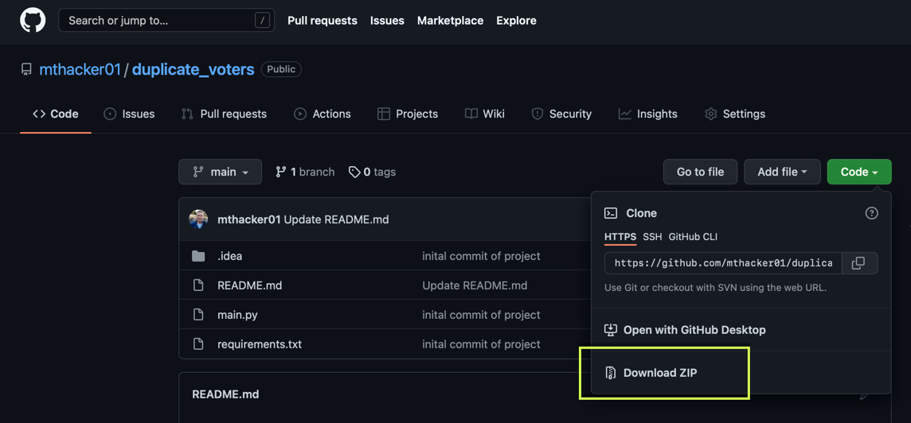
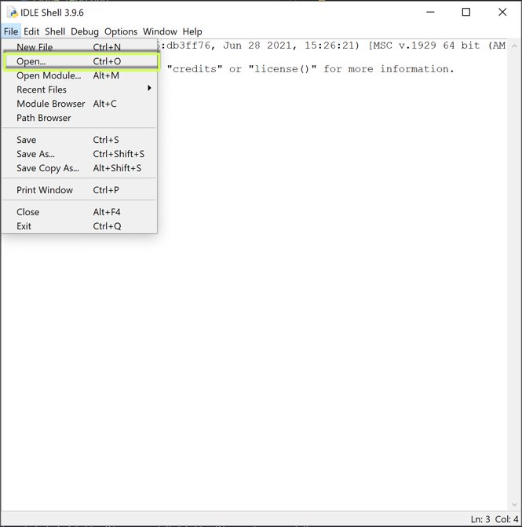
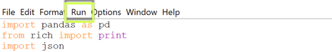
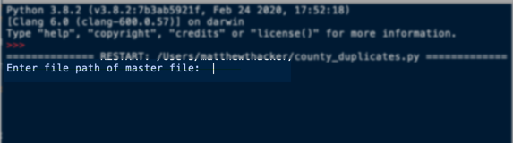

# Using the Duplicate Voter script

## Getting Set up

### If you do not have Python installed on your machine:

If you're uncertain if you have Python installed, open your command prompt by pressing (Windows Key + R) and typing __cmd__

Once the command prompt appears, type __python3__.

If Python is installed, your command prompt will turn into a Python shell. 

If Python IS NOT installed, the Microsoft App store will be launched ,and you'll be prompted to download and install.

### Windows users
 1. Download Python to your machine using one of the following two methods:
    1. via the Python website, [here](https://www.python.org/downloads/)
    2. The Microsoft App store (see above)

 2. Once Python is downloaded, ensure Python and it's libraries are on PATH. You can do this by opening your command prompt and running the following command:  replacing username and Python version (if different from 3.10)
 <code> setx PATH "%PATH%; C: \Users\{username}\AppData\Local\Programs\Python\Python310\scripts" </code>

## Running the Script

Clone the GitHub [repo](https://github.com/mthacker01/duplicate_voters): 
1. Click __Code__
2. Download the Zip file (shown below)

Move the file that was downloaded to an easily accessible folder (i.e. Desktop)

Open the command prompt and run the following (replacing **path** with the full file pathway to the folder:

<code> pip install -r /path/to/requirements.txt </code>

This will install all the necessary dependencies for the script (Pandas, Openpyxl, Rich)

Navigate to the folder with the repo that you downloaded and double-click on the __main.py__ file.

This should open your Python IDLE shell

Or you can open the IDLE shell and open the file like below:

Click Run > Run Module

This will open the IDLE shell and will prompt you to enter the FULL file path name to where the master Excel sheet is located

#### <em><u>The file type must be an Excel file ending in .xlsx</u></em>

Entering a pathway that does not end in .xlsx will error out and prompt you for a file path again

<li> Press Enter </li>

The terminal will then prompt you for a full file path where you want all the files saved.

i.e. C: \Users\{username}\Desktop\Duplicate_Folder

<li> Press Enter </li>

If no errors arise in the IDLE shell, the script worked. Navigate to the folder where you listed as the output and all the files should have been created.
